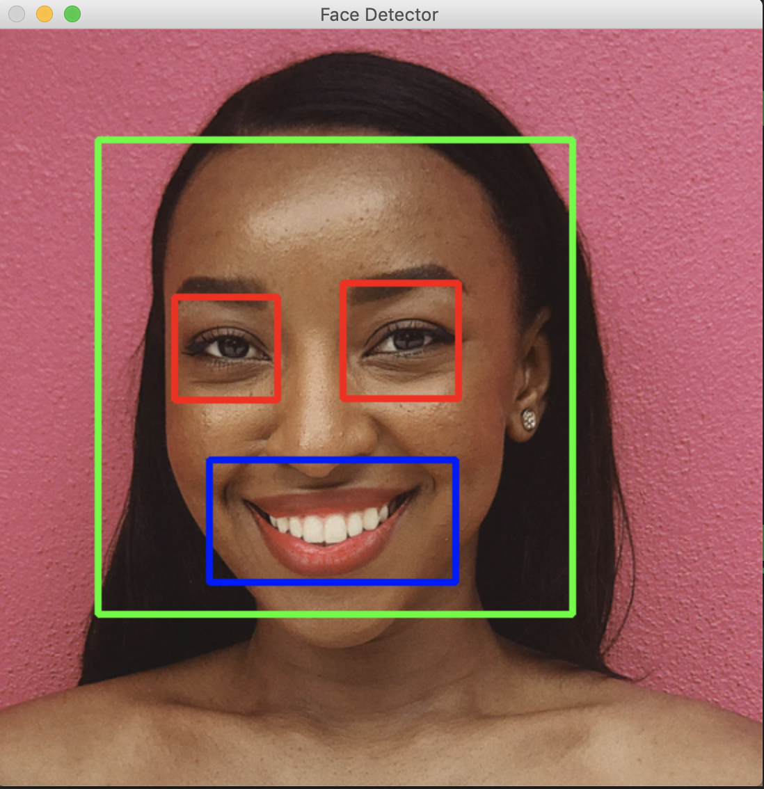
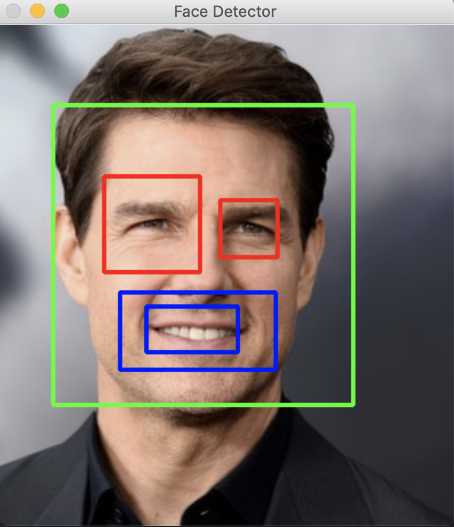

# Face Detector App

#### Hello Everyone, this is face detector app, used for detector a face, eyes and a smile. This is used in Instagram filters and Snapchat, this is uses the opencv library and their models. The base model is simple you just pass in an image and the it will figure out the face, the eyes and if their is a smile. 

## Here is sample output 👇

#### As you can see it does a pretty good job in determining a face. You can clone this repo and make some changes to the code, and I will definitely implement your code in this repo. You can give more suggestion here 👇
#### Twitter 🐦 https://twitter.com/shashanke7y 
#### Linkden 💼 https://www.linkedin.com/in/shashank-ellareddy-2b43aa200/
#### Discord 💬 DevboiiiShash#5177

# Happy Coding 
